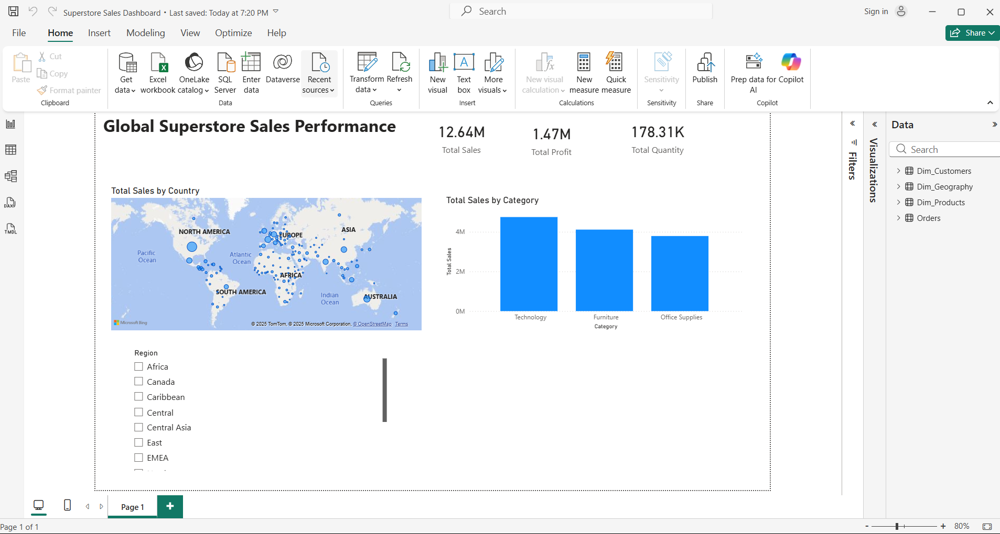

  # 01. Global Superstore Sales Dashboard

  **Project Overview**

  This Power BI project analyzes the Global Superstore dataset to visualize sales performance and profitability. The primary goal is to identify key trends and provide actionable recommendations to drive business strategy.

  **Dashboard Preview**

  

  **Insights & Recommendations**

  *  **Insight 1 : Profitability Concern**
     * The Central region, despite generating sales, suffers from extremely low or even negative profit margins, especially within the Furniture category.
     * **Recommendation:** Initiate a cost analysis for furniture sales in the Central region. Investigate if high shipping costs or excessive discounting are eroding profits before making decisions about this product line.
   
  *  **Insight 2: High-Margin Product Focus**
     * The Technology category is the clear leader, consistently delivering the highest sales and profit.
     * **Recommendation:** Prioritize and increase marketing budget for new technology products, targeting top-performing countries(like the USA and India) to maximize return on investment.

  *  **Insight 3: Untapped Market Potential**
     *   Emerging markets, particularly in Africa, have a very small sales footprint and represent a significant growth opportunity.
     *   **Recommendation:** Propose a pilot marketing campaign in a key Africa market to test viability and assess the potential for long-term expansion.

  **Technical Skills Demonstrated**

  * **Power BI:** Data Modeling(Star Schema), Power Query for data transformation.
  * **DAX:** Creation of key measures('Total Sales', 'Total Profit', 'Total Quantity').
  * **Visualization:** Interactive KPI cards, bar charts, and geographical maps.
  * **Analysis** Translating data observations into actionable business recommendations.
